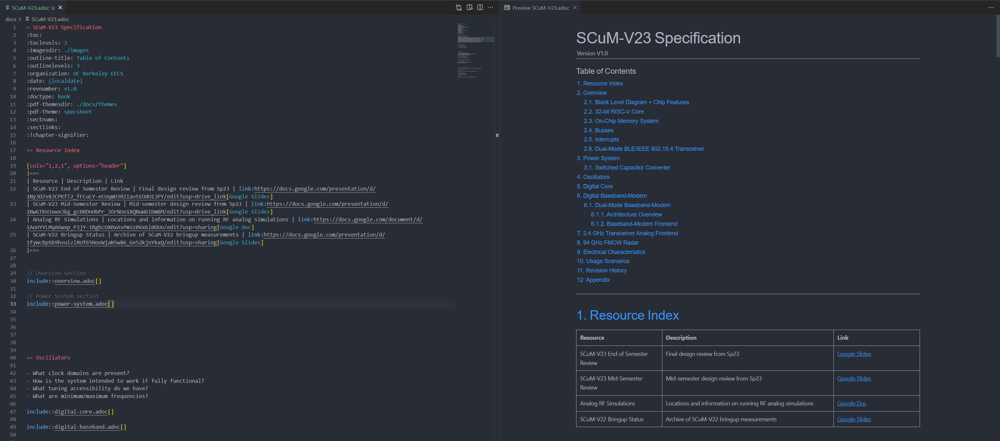
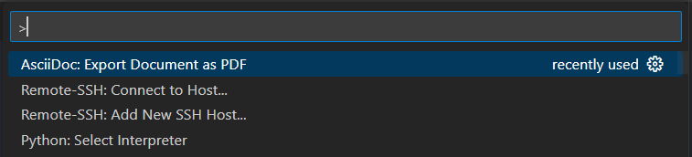

# Contributing to the specification document

## AsciiDoc

### Introduction

AsciiDoc is a lightweight markup language for authoring notes, articles, documentation, books, web pages, slide decks, and more. It is designed to be simple yet powerful, allowing for rich text formatting with easy-to-read syntax.

### Recommended development environment

Visual Studio Code supports the AsciiDoc extension, which provides syntax highlighting, previewing, and exporting to PDF. It can be installed from the Visual Studio Code Marketplace.

https://marketplace.visualstudio.com/items?itemName=asciidoctor.asciidoctor-vscode

The preview can be opened by pressing `Ctrl+Shift+V` (current tab) & `Ctrl-K, V` (split tab) or by clicking the preview icon in the top right corner of the editor.



**Highly recommended** is the [Paste Image](https://marketplace.visualstudio.com/items?itemName=mushan.vscode-paste-image) extension which allows you to paste images directly into the editor. This is very useful for adding screenshots to the document.

Once installed, you can paste an image from the clipboard by pressing `Ctrl+Alt+V`.

### Exporting PDFs locally (optional)

0. **Install Ruby** AsciiDoctor runs on Ruby, so this is a prerequisite if you would like to export the PDFs locally. Though being able to export the PDFs locally is not strictly necessary.

   For Windows users, Ruby Installer is the easiest: https://rubyinstaller.org/

1. **Install AsciiDoctor**: To convert AsciiDoc files to PDF, you'll need the `asciidoctor-pdf` tool. You can install it using the following command:

   ```shell
   gem install asciidoctor-pdf
   ```

2. **Export the PDF from the editor**: To export the PDF, open the command palette (`Ctrl+Shift+P`) and select `AsciiDoc: Export document as PDF`.

   

   The PDF will be saved in the same directory as the AsciiDoc file.


