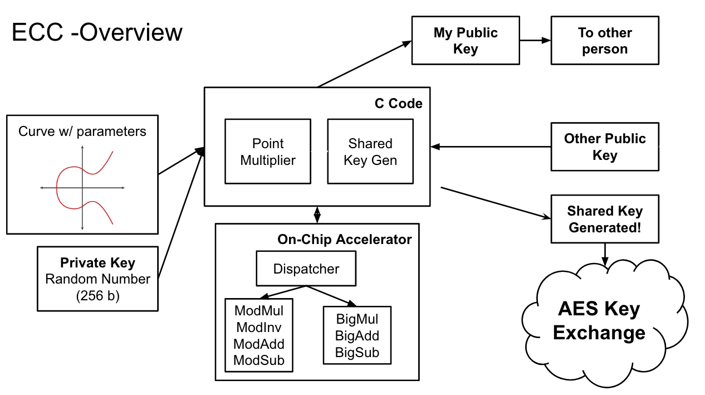
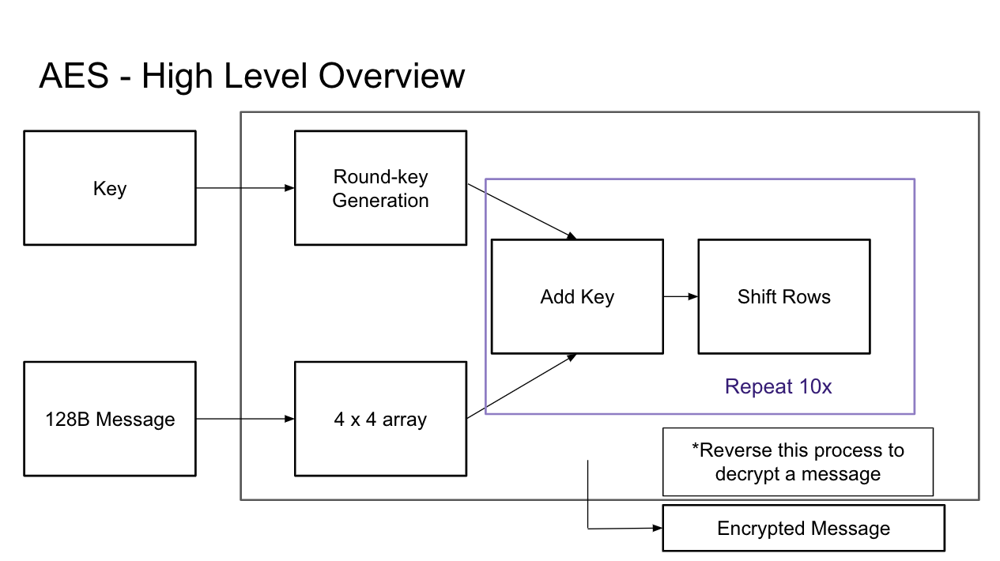

== Encryption Modules

Establish secure communication between two devices in following steps:

1. Share key Elliptic Curve Cryptography (ECC)
2. Sender encrypts message using Advanced Encryption Standard (AES) and shared key
3. Receiver decrypts message using AES and shared key
4. Receiver verifies message integrity using SHA-256

image::images/encryption_modules_overview.png[] 

=== ECC

ECC uses Chisel implementation and calls the Accelerator through C for math operations. Muliplier sizing is optimized.

 

=== AES

AES uses Chisel implementation and AES is synthesizable on a Rocket chip. Users can call AES accelerator functions through software by utilizing software interrupts. The process involves loading the encryption key and message, initiating the encryption or decryption process, and optionally utilizing diagnostic tools to monitor cycle time for computation completion. The implementation has been thoroughly tested using C testbenches and validated with third-party online software tools. On average, it takes approximately 6 cycles per word, which equates to about 10 nanoseconds per byte for AES operations.

 

=== SHA-256

SHA-256 part combines multiple hash functions for its operation. It divides data into eight 16-bit chunks, denoted as A to H, and performs bitwise XOR, AND, and bit-shifting operations on these chunks. It shares similar implementation and capabilities with an AES accelerator, with the exception of its hashing functionality. The project includes C testbenches, similar to those used for AES, and has been verified using third-party online software tools. On average, it takes approximately 107 cycles to process 256 bits of data, which translates to about 70 nanoseconds per byte for hash computations.

