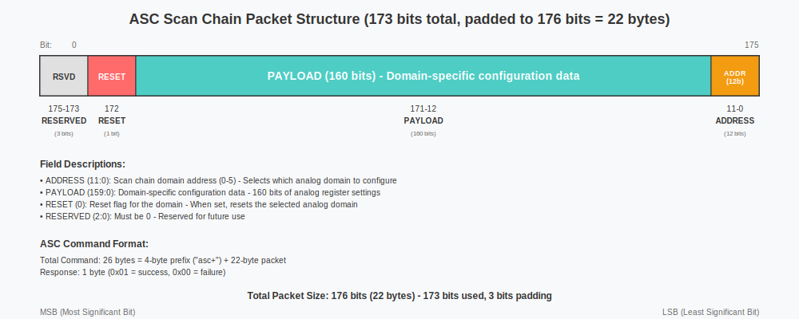
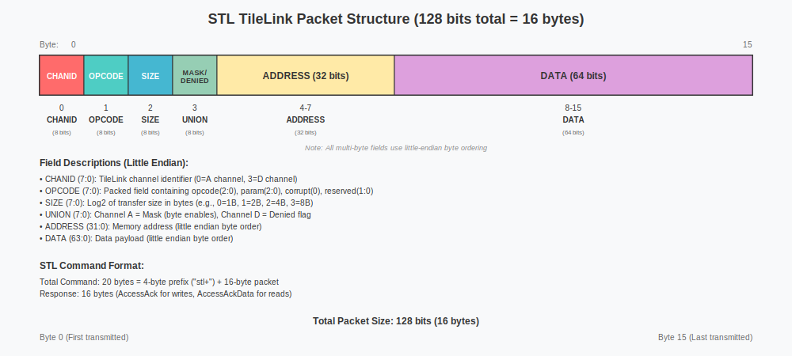

# SCuM-V Controller Dual-Mode FPGA Design Specification

## 1. Overview

The SCuM-V Controller is a dual-mode FPGA implementation that provides UART-based access to both the Analog Scan Chain (ASC) and Serial TileLink (STL) interfaces of the SCuM-V chip. This design enables a single FPGA to handle both analog configuration and digital debugging/programming functionality.

### 1.1 System Requirements

The controller must support three logical protocols: Analog Scan Chain (ASC), Serial TileLink (STL), and a DUT UART Passthrough bridge. It multiplexes among them by detecting a 4-byte prefix ("asc+", "stl+", or "uar+") at the start of each incoming UART command from the host. Bytes originating on the DUT UART and forwarded to the host SHALL be framed by the FPGA using the same "uar+" prefix (see §3.4). The design must maintain compatibility with the existing Python host scripts (`hw/client.py` and `sw/tl_host.py`) and support configurable baud rates up to and including 2 MBaud. To ensure compliance with the SCuM-V24B ASIC, the implementation will reuse the exact `GenericSerializer` and `GenericDeserializer` modules. Architecturally, the design will follow a clean, hierarchical structure with well-defined FIFO-based interfaces between modules.

## 2. System Architecture

### 2.1 High-Level Block Diagram

```
┌─────────────────────────────────────────────────────────────────────────────────────────────────────────────────┐
│                                         SCuM-V Controller FPGA                                                    │
├───────────────────┬──────────────────────────────────────────────────────┬────────────────────────────────────────┤
│   External Host   │               UART Protocol Handler                │           Processing Subsystems          │
│                   │                                                      │                                        │
│  ┌──────────────┐ │  ┌─────────────┐   ┌─────────────────┐               │  ┌────────────────────────────────────┐  │
│  │   Host PC    │◄─►│    UART     │───│    Protocol     │───────────────│──│             ASC Subsystem            │  │
│  │              │ │  │  Interface  │   │   Detection     │               │  │  ┌──────────┐┌──────────┐┌──────────┐│  │
│  │• client.py   │ │  │             │   │ ('asc+'/'stl+') │               │  │  │  UART    ││  Scan    ││  Scan    ││  │
│  │• tl_host.py  │ │  └─────────────┘   └─────────────────┘               │  │  │  Client  ││  Writer  ││ Hardware ││  │
│  └──────────────┘ │           │                 │                        │  │  └──────────┘└──────────┘└──────────┘│  │
│                   │           │                 │                        │  └────────────────────────────────────┘  │
│                   │           │                 │                        │                                        │
│                   │           └─────────────────┼────────────────────────┘                                        │
│                   │                             │                                                                 │
│                   │                             ▼                        ┌────────────────────────────────────┐  │
│                   │                     ┌───────────────┐                │             STL Subsystem            │  │
│                   │                     │ Routing Logic │                │                                        │  │
│                   │                     └───────┬───────┘                │  ┌─────────────────┐┌─────────────────┐ │  │
│                   │                             │                        │  │  Outgoing Path  ││  Incoming Path  │ │  │
│                   │          ┌──────────────────┴──────────────────┐     │  │                 ││                 │ │  │
│                   │          │                                   │     │  │ ┌─────────────┐ ││ ┌─────────────┐ │ │  │
│                   │          ▼                                   ▼     │  │ │   Outgoing  │ ││ │  Incoming   │ │ │  │
│                   │  ┌───────────────┐                   ┌───────────────┐ │  │ │UART Client  │ ││ │UART Client  │ │ │  │
│                   │  │ To ASC FIFO   │                   │ To STL FIFO   │ │  │ └─────────────┘ ││ └─────────────┘ │ │  │
│                   │  └───────────────┘                   └───────────────┘ │  │        │        ││        ▲        │ │  │
│                   │                                                      │  │        ▼        ││        │        │ │  │
│                   │                                                      │  │ ┌─────────────┐ ││ ┌─────────────┐ │ │  │
│                   │                                                      │  │ │ UART→TL     │ ││ │ TL→UART     │ │ │  │
│                   │                                                      │  │ │   Bridge    │ ││ │   Bridge    │ │  │
│                   │                                                      │  │ └─────────────┘ ││ └─────────────┘ │ │  │
│                   │                                                      │  │        │        ││        ▲        │ │  │
│                   │                                                      │  │        └────────│─│────────┘        │ │  │
│                   │                                                      │  │                 ││                 │ │  │
│                   │                                                      │  │     ┌─────────────────────────┐    │ │  │
│                   │                                                      │  │     │      SerialTL Bus       │    │ │  │
│                   │                                                      │  │     │  TL_CLK, TL_IN_*, TL_OUT_*│    │ │  │
│                   │                                                      │  │     │    (to/from SCuM-V)     │    │ │  │
│                   │                                                      │  │     └─────────────────────────┘    │ │  │
│                   │                                                      │  └─────────────────┴─────────────────┘ │  │
│                   │                                                      └────────────────────────────────────────┘  │
└───────────────────┴──────────────────────────────────────────────────────┴────────────────────────────────────────┘
```

**See also:** [PlantUML System Diagram](system_diagram.puml) for a clean, professional version of this architecture.

### 2.2 Implemented Module Hierarchy

```
a7top
├── scumvcontroller_uart_handler
│   └── uart (internal UART instance)
├── scanchain_subsystem
│   ├── scanchain_uart_client (modified for FIFO interface)
│   └── scanchain_writer (existing, unchanged)
├── serialtl_subsystem
│   ├── stl_uart_client
│   ├── uart_to_tilelink_bridge
│   ├── GenericSerializer (ASIC-provided)
│   ├── GenericDeserializer (ASIC-provided)
│   └── tilelink_to_uart_bridge
├── dut_uart_subsystem
│   └── uart (second instance for DUT UART passthrough)
└── button_parser (existing, unchanged)
```

## 3. Communication Protocols

### 3.1 UART Command Format

All commands from the host PC follow this format:

```
[PREFIX][PAYLOAD]
```

- **PREFIX**: 4-byte string identifier
  - "asc+" (0x61, 0x73, 0x63, 0x2B) for Analog Scan Chain
  - "stl+" (0x73, 0x74, 0x6C, 0x2B) for Serial TileLink
  - "uar+" (0x75, 0x61, 0x72, 0x2B) for DUT UART Passthrough
- **PAYLOAD**: Protocol-specific data

### 3.2 ASC Protocol Specification

#### 3.2.1 ASC Command Format
```
Prefix: "asc+" (4 bytes)
Payload: Scan Chain Packet (22 bytes)

Total ASC Command: 26 bytes
```

#### 3.2.2 ASC Packet Structure
The 22-byte payload contains a scan chain packet with the following bit layout:



- **Address [11:0]**: Scan chain domain address (0-5)
- **Payload [159:0]**: Domain-specific configuration data
- **Reset [0]**: Reset flag for the domain
- **Reserved [2:0]**: Must be 0

#### 3.2.3 ASC Response Format
```
Response: 1 byte
- 0x01: Command accepted and processed successfully
- 0x00: Command rejected or processing failed
```

### 3.3 STL Protocol Specification

#### 3.3.1 STL Command Format
```
Prefix: "stl+" (4 bytes)
Payload: TileLink Packet (16 bytes)

Total STL Command: 20 bytes
```

#### 3.3.2 TileLink Packet Structure
The 16-byte payload contains a TileLink transaction:



#### 3.3.3 STL Response Format
For STL commands, responses depend on the transaction type:
- **Write (PutFullData)**: Returns AccessAck packet (16 bytes)
- **Read (Get)**: Returns AccessAckData packet (16 bytes)

### 3.4 DUT UART Passthrough Protocol Specification

#### 3.4.1 Command Format (Host → FPGA → DUT)
```
Prefix: "uar+" (4 bytes)
Payload:
  LEN (1 byte): number of data bytes to forward to the DUT UART (1..255). LEN=0 is reserved.
  DATA (LEN bytes): raw UART payload to transmit to the DUT.
Total: 5 + LEN bytes
```

#### 3.4.2 Response Format (DUT → FPGA → Host)
For each chunk of bytes received on the DUT UART, the FPGA emits a framed message to the host:
```
"uar+" + LEN (1 byte) + DATA (LEN bytes)
```
Framing behavior:
- The FPGA may coalesce or fragment the DUT UART stream.
- A frame is emitted when either (a) LEN reaches a configurable high-watermark (≤255), or (b) an inter-byte idle timeout elapses (default 1 ms), whichever occurs first.
- Frames may be emitted back-to-back and may interleave with "stl+" and "asc+" responses.

#### 3.4.3 Notes
- The host must demultiplex by prefix when parsing FPGA→host traffic.
- No additional CRC is applied; underlying UART framing and optional higher-level checks are assumed sufficient for bring-up/debug. A future extension may add a simple checksum if needed.

## 4. Hardware Interface Specifications

### 4.1 External Interfaces (a7top.v)

#### 4.1.1 UART Interface
```verilog
// Primary communication with host PC
input  wire UART_TXD_IN,  // Data from host PC
output wire UART_RXD_IN   // Data to host PC
```

#### 4.1.2 ASC Interface
```verilog
// Analog Scan Chain signals to SCuM-V
output wire SCAN_CLK,     // Scan chain clock (1kHz)
output wire SCAN_EN,      // Scan chain enable (active low)
output wire SCAN_IN,      // Serial data to scan chain
output wire SCAN_RESET    // Scan chain reset
```

#### 4.1.3 SerialTL Interface
```verilog
// SerialTL interface to SCuM-V (clock domain crossing required)
input  wire TL_CLK,        // TileLink clock from SCuM-V
input  wire TL_IN_VALID,   // Valid signal for data going to SCuM-V
output wire TL_IN_READY,   // Ready signal for data going to SCuM-V
input  wire TL_IN_DATA,    // Serial data going to SCuM-V
output wire TL_OUT_VALID,  // Valid signal for data coming from SCuM-V
input  wire TL_OUT_READY,  // Ready signal for data coming from SCuM-V
output wire TL_OUT_DATA    // Serial data coming from SCuM-V
```

#### 4.1.4 DUT UART Interface
```verilog
// DUT (SCuM-V) UART passthrough signals
input  wire DUT_UART_TXD_IN,   // UART TX from DUT (into FPGA)
output wire DUT_UART_RXD_OUT   // UART RX to DUT (from FPGA)
```

### 4.2 Internal FIFO Interfaces

The `scumvcontroller_uart_handler` module serves as the primary interface to the host. Because the TileLink clock (`TL_CLK`) runs much slower than a typical UART baud rate (e.g., 200kHz vs. 2Mbaud), internal FIFOs are essential for flow control. They prevent data loss by buffering incoming and outgoing data, allowing the different clock domains to operate without dropping packets. The handler's architecture ensures that complete packets are buffered before being processed and that both subsystems see a consistent data flow regardless of UART timing.

UART Handler Internal Architecture:
┌─────────────────────────────────────────────────────────────────┐
│                    scumvcontroller_uart_handler                 │
│                                                                 │
│   ┌─────────┐    ┌─────────────┐   ┌───────────┐   ┌─────────┐    │
│   │ UART RX │───►│ Incoming    │──►│ Protocol  │──►│ ASC/STL │───►│ Subsystems
│   └─────────┘    │ FIFO (128B) │   │ Detection │   │ Mux     │    │
│                  └─────────────┘   └───────────┘   └─────────┘    │
│                                                                 │
│   ┌─────────┐    ┌─────────────┐   ┌───────────┐   ┌─────────┐    │
│   │ UART TX │◄───│ Outgoing    │◄──│ Response  │◄──│ ASC/STL │◄───│ Subsystems
│   └─────────┘    │ FIFO (128B) │   │ Mux       │   │ Demux   │    │
│                  └─────────────┘   └───────────┘   └─────────┘    │
└─────────────────────────────────────────────────────────────────┘
```

**FIFO Specifications:**
- **Incoming FIFO**: 128-byte depth, buffers UART data before protocol processing
- **Outgoing FIFO**: 128-byte depth, buffers subsystem responses before UART transmission
- **Flow Control**: Prevents data loss during clock domain differences
- **Protocol Isolation**: Each subsystem sees consistent data flow regardless of UART timing

#### 4.2.2 Standard FIFO Interface
All subsystem interfaces follow this standard pattern:
```verilog
// Input data stream
input  wire       data_valid,     // Data available from source
output wire       data_ready,     // Ready to accept data
input  wire [7:0] data_in,        // Input data byte

// Output response stream  
output wire       response_valid, // Response data available
input  wire       response_ready, // Sink ready for response
output wire [7:0] response_data   // Response data byte
```

#### 4.2.2 UART Handler Interface
```verilog
module scumvcontroller_uart_handler (
    // Clock and reset
    input  wire       clk,
    input  wire       reset,
    
    // External UART
    input  wire       uart_rx,
    output wire       uart_tx,
    
    // ASC subsystem FIFO interface
    output wire       asc_data_valid,
    input  wire       asc_data_ready,
    output wire [7:0] asc_data_out,
    input  wire       asc_response_valid,
    output wire       asc_response_ready,
    input  wire [7:0] asc_response_data,
    
    // STL subsystem FIFO interface
    output wire       stl_data_valid,
    input  wire       stl_data_ready,
    output wire [7:0] stl_data_out,
    input  wire       stl_response_valid,
    output wire       stl_response_ready,
    input  wire [7:0] stl_response_data,

    // DUT UART passthrough FIFO interface
    // Host→DUT data (after removing "uar+" prefix and LEN)
    output wire       uar_data_valid,
    input  wire       uar_data_ready,
    output wire [7:0] uar_data_out,
    // DUT→Host data (raw bytes; handler frames into "uar+" + LEN + DATA)
    input  wire       uar_response_valid,
    output wire       uar_response_ready,
    input  wire [7:0] uar_response_data,
    
    // Status and control
    output wire [1:0] active_mode,   // 0=idle, 1=asc, 2=stl (note: uar handled as stream, not latched mode)
    output wire [3:0] debug_state    // Internal state for debugging
);
```

#### 4.2.3 Subsystem Interfaces
```verilog
// Scanchain Subsystem
module scanchain_subsystem (
    input  wire       clk, reset,
    // Standard FIFO interface (input)
    input  wire       data_valid,
    output wire       data_ready,
    input  wire [7:0] data_in,
    // Standard FIFO interface (output) 
    output wire       response_valid,
    input  wire       response_ready,
    output wire [7:0] response_data,
    // Hardware interface
    output wire       scan_clk, scan_en, scan_in, scan_reset
);

// SerialTL Subsystem  
module serialtl_subsystem (
    input  wire       clk, reset,
    // Standard FIFO interface (input)
    input  wire       data_valid,
    output wire       data_ready, 
    input  wire [7:0] data_in,
    // Standard FIFO interface (output)
    output wire       response_valid,
    input  wire       response_ready,
    output wire [7:0] response_data,
    // SerialTL hardware interface
    input  wire       tl_clk, tl_in_valid, tl_in_data,
    output wire       tl_in_ready, tl_out_valid, tl_out_data,
    input  wire       tl_out_ready
);

// DUT UART Passthrough Subsystem
module dut_uart_subsystem (
    input  wire       clk, reset,
    // Host→DUT byte stream (from handler after stripping prefix+len)
    input  wire       data_valid,
    output wire       data_ready,
    input  wire [7:0] data_in,
    // DUT→Host byte stream (to handler for framing)
    output wire       response_valid,
    input  wire       response_ready,
    output wire [7:0] response_data,
    // DUT UART physical lines
    input  wire       dut_uart_txd_in,   // from DUT
    output wire       dut_uart_rxd_out   // to DUT
);
```

## 5. Data Flow Diagrams

### 5.1 ASC Command Flow

```
 Host PC        UART Handler        Scanchain Subsystem      SCuM-V ASC
─────────      ──────────────      ───────────────────     ────────────
"asc+"+22B ───►                 
(26B total)    Strip "asc+" prefix
               ┌───────────────────►     22B Packet
               │                     ┌───────────────────►   SCAN_*
               │                     │                     Signals
               │     1B Status       │
               ◄───────────────────┘
 1B Status ◄───┘
```

### 5.2 STL Command Flow
```
 Host PC         UART Handler          SerialTL Subsystem       SCuM-V SerialTL
─────────       ──────────────        ────────────────────     ───────────────
"stl+"+16B ───►                   
(20B total)     Strip "stl+" prefix
                ┌───────────────────►       16B Packet
                │                     ┌────────────────────►    TL_OUT_*
                │                     │                      (Serialized)
                │                     │
                │     16B Response    │      16B Response
                │   ◄───────────────────┘  ◄────────────────────    TL_IN_*
                │                                                (Deserialized)
16B Resp ◄──────┘

```

### 5.3 Protocol Detection State Machine
```
                      ┌───────────┐
                      │   IDLE    │
                      └─────┬─────┘
                            │ UART Byte
              ┌─────────────▼─────────────┐
        'a' ──┤         PREFIX_1          ├── 's'
              └─────────────┬─────────────┘
                            │             
              ┌─────────────▼─────────────┐
        's' ──┤         PREFIX_2          ├── 't' / 'u'
              └─────────────┬─────────────┘
                            │
              ┌─────────────▼─────────────┐
        'c' ──┤         PREFIX_3          ├── 'l' / 'r'
              └─────────────┬─────────────┘
                            │
              ┌─────────────▼─────────────┐
        '+' ──┤         PREFIX_4          ├── '+'
              └─────────────┬─────────────┘
                            │
          ┌─────────────────▼──────────────────┐
          │        DETERMINE_PROTOCOL          │
          └─────────┬───────────┬──────────────┘
                    │           │
           "asc+"   │           │   "stl+"
           ┌────────▼─┐       ┌─▼────────┐        "uar+"
           │ ASC_MODE │       │ STL_MODE │◄──────┐
           │ 22 bytes │       │ 16 bytes │       │ LEN (1B) +
           └────────┬─┘       └─┬────────┘       │ DATA (LENB)
                    │           │                │ (stream)
           ┌────────▼─┐       ┌─▼────────┐       │
           │ ASC_RESP │       │ STL_RESP │       │
           │  1 byte  │       │ 16 bytes │       │
           └──────────┘       └──────────┘       └─────────────► framed by handler
```

### 5.4 UART Passthrough Flow
```
 Host PC           UART Handler           DUT UART Subsystem              SCuM-V UART
─────────         ──────────────         ────────────────────            ────────────
"uar+"+LEN+N  ───► Strip prefix+LEN ───► N raw bytes ────────────────►   DUT_RX
               
               ◄────────────────────────────────  Bytes from DUT RX (raw)
         Frame into "uar+" + LEN + DATA  ◄───┘
           (coalesce/idle-timeout)

```

## 6. Testbench Architecture

### 6.1 TileLink Echo and Inspection System

The integration testbench implements a sophisticated TileLink echo and inspection system for comprehensive validation:

```
┌──────────────────────────────────────────────────────────────────────────┐
│                      Integration Testbench Architecture                    │
│                                                                          │
│  ┌────────────────┐      UART       ┌──────────────────────────────────┐   │
│  │  Test Vector   │ ───────────────►│             a7top DUT            │   │
│  │   Generator    │                 │                                  │   │
│  └────────────────┘                 │   ┌────────────────────────────┐ │   │
│                                     │   │   serialtl_subsystem       │ │   │
│  ┌────────────────┐                 │   └─────────────┬──────────────┘ │   │
│  │ UART Response  │◄────────────────│                 │                │   │
│  │    Capture     │                 └─────────────────┼────────────────┘   │
│  └────────────────┘                                   │ TL_OUT           │
│                                                       ▼                  │
│  ┌─────────────────────────────────────────────────────────────────────┐ │
│  │                    TileLink Echo & Inspection                       │ │
│  │                                                                     │ │
│  │    TL_OUT ──► GenericDeserializer ──► Packet ──► GenericSerializer ──► TL_IN │
│  │                                        │                            │ │
│  │                                        │                            │ │
│  │                                        ▼                            │ │
│  │                              ┌─────────────────┐                      │ │
│  │                              │ Packet Inspector│                      │ │
│  │                              │   & Validator   │                      │ │
│  │                              └─────────────────┘                      │ │
│  └─────────────────────────────────────────────────────────────────────┘ │
└──────────────────────────────────────────────────────────────────────────┘
```

**Key Features:**
- **Realistic Echo**: Deserialize → re-serialize path provides proper timing behavior
- **Complete Inspection**: All TileLink packet fields captured and displayed
- **Content Validation**: Assertions verify packet field validity (size, channel, opcode)
- **Pass/Fail Criteria**: Comprehensive validation including UART responses, packet counts, and assertion results

### 6.2 Validation Methodology

The testbench provides multi-level validation:

1. **UART Level**: Verifies byte-level communication and response capture
2. **TileLink Level**: Validates packet structure and content correctness  
3. **Echo Level**: Confirms commands are properly echoed back via TL_IN
4. **System Level**: Overall pass/fail based on all validation criteria

**Assertion Strategy:**
- Content-based assertions only (no timing assumptions)
- Field range validation (size ≤ 0x06, channel ≤ 0x2, opcode ≤ 0x6)
- Packet count tracking for echo verification
- Graceful error reporting with detailed failure information

### 6.3 Verification Strategy

#### 6.3.1 Module-Level Testing
- **UART Handler**: Test prefix detection state machine with various input sequences
- **ASC Subsystem**: Validate against existing `hw/client.py` without modifications
- **STL Bridges**: Unit tests for packet ↔ TileLink frame conversion
- **Clock Domain Crossing**: Verify TL_CLK ↔ FPGA_CLK data transfer

#### 7.2.2 System-Level Testing  
- **Protocol Switching**: Send alternating "asc+" and "stl+" commands
- **Error Handling**: Test invalid prefixes, incomplete packets, and timeouts
- **End-to-End**: Full transactions through both ASC and STL paths
- **Performance**: Verify throughput and latency requirements meet specifications

#### 7.2.3 Hardware Validation
- **SCuM-V Integration**: Test with actual SCuM-V24B hardware
- **Host Compatibility**: Validate with unmodified `hw/client.py` and `sw/tl_host.py`
- **LED Indicators**: Verify that debug outputs on the FPGA board match the expected system state

### 7.3 Key Design Decisions

The final architecture was shaped by several key design decisions. A three-level hierarchy (top-level, subsystem, and implementation) was chosen to create a clean separation of concerns. Standardizing on a ready/valid FIFO handshake provides a consistent and reliable interface pattern throughout the design. This modularity also ensures that the ASC and STL subsystems are fully independent and can be tested in isolation. The simple and reliable prefix-based routing mechanism was selected for protocol detection. Finally, to guarantee correctness, the design reuses the exact `GenericSerializer` and `GenericDeserializer` modules from the SCuM-V24B ASIC without modification.

Additional decision: extend the prefix space with `"uar+"` to carry DUT UART payloads bidirectionally. UART bytes are length-framed at the FPGA boundary to avoid ambiguity and allow interleaving with STL/ASC traffic without breaking legacy tooling.

